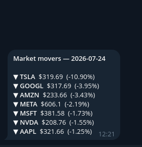
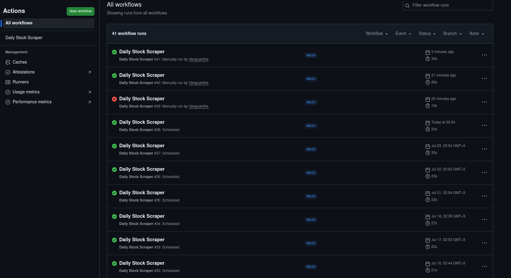

# Stock Price Tracker

Automated daily collector that pulls stock prices from Yahoo Finance, appends
them to a CSV, and sends a Telegram alert when a stock makes a significant
move. Runs entirely on GitHub Actions every weekday: no server, no hosting
cost, no manual input.



## What it does

- Fetches closing prices for 7 major stocks (AAPL, TSLA, GOOGL, MSFT, AMZN,
  NVDA, META)
- Calculates daily % change vs previous close
- Appends results to `prices.csv`
- Sends a Telegram alert when a stock moves more than 3% in a day, sorted by
  how far it moved
- Runs automatically Monday–Friday at 21:00 UTC, after the US market close

## Stack

Python · yfinance · GitHub Actions · Telegram Bot API

## Output format

| date | symbol | price | prev_close | change_pct |
|------|--------|-------|------------|------------|
| 2026-06-04 | AAPL | 201.45 | 199.30 | +1.08 |
| 2026-06-04 | TSLA | 178.90 | 181.20 | -1.27 |

## Alerts

Quiet days produce no message. The threshold lives in `ALERT_THRESHOLD` in
`scraper.py` and defaults to 3%. A failed notification is logged and ignored
rather than allowed to break the collection run, since the data matters more
than the message.

## Automation



The schedule, permissions and commit step live in
[`.github/workflows/scraper.yml`](.github/workflows/scraper.yml). The job runs
on a cron trigger, commits the updated CSV back to the repository, and can
also be started manually from the Actions tab.

## Setup

Telegram credentials are read from environment variables and stored as
repository secrets under Settings → Secrets and variables → Actions:

| Secret | Where to get it |
|---|---|
| `TELEGRAM_BOT_TOKEN` | @BotFather |
| `TELEGRAM_CHAT_ID` | @userinfobot |

Without them the scraper still collects and stores data, it just skips the
notification.

## Run locally

```bash
pip install -r requirements.txt
python scraper.py
```

To get alerts locally, export the same two variables before running.

## License

Released under the [MIT License](LICENSE).
